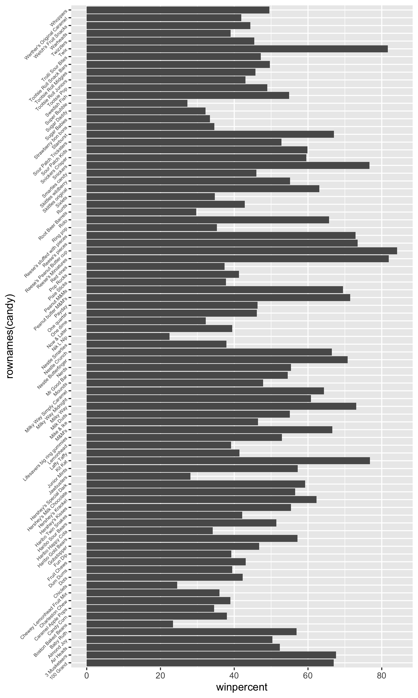
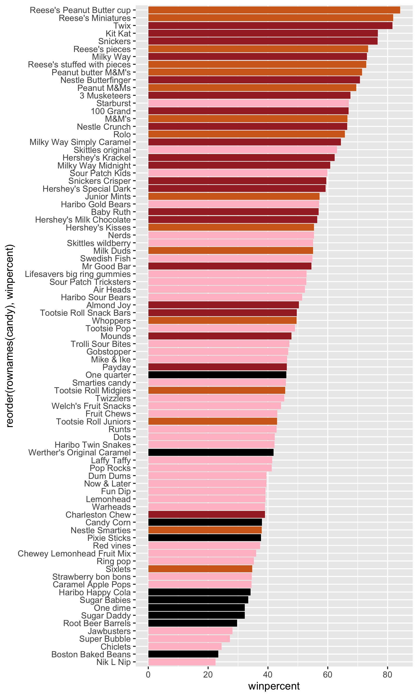

## Background

Importing Candy Data, the data comes as a CSV file from 538. 

```{r}
candy_file <- read.csv("https://raw.githubusercontent.com/fivethirtyeight/data/master/candy-power-ranking/candy-data.csv", row.names = 1)
candy = read.csv( "https://raw.githubusercontent.com/fivethirtyeight/data/master/candy-power-ranking/candy-data.csv" , row.names = 1 )
```

> Q1. How many different candy types are in this dataset?

```{r}
nrow(candy_file)
```

There are 85 different candy types in this dataset.

> Q2. How many fruity candy types are in the dataset?

```{r}
table(candy_file$fruity)
```

There are 38 fruity candy types. 

## Winpercent

```{r}
candy_file["Twix", ]$winpercent
```

```{r}
library(dplyr)

candy_file |> 
  filter(row.names(candy_file)=="Twix") |> 
  select(winpercent)
```

> Q3. What is your favorite candy (other than Twix) in the dataset and what is it’s winpercent value?

My favorite candy is Snickers and the winpercent value is 76.67378.

```{r}
candy_file["Snickers", ]$winpercent
```

> Q4. What is the winpercent value for “Kit Kat”?

The winpercent value for Kit Kat us 76.7686.

```{r}
candy_file["Kit Kat", ]$winpercent
```

> Q5. What is the winpercent value for “Tootsie Roll Snack Bars”?

The winpercent value for Tootsie Roll Snack Bars is 49.6535.

```{r}
candy_file["Tootsie Roll Snack Bars", ]$winpercent
```

```{r}
library("skimr")
skim(candy_file)
```

> Q6. Is there any variable/column that looks to be on a different scale to the majority of the other columns in the dataset?

The "n_missing" and "complete_rate" columns are on a 0 or 1 scale instead of 0 to 1 values.  

> Q7. What do you think a zero and one represent for the candy$chocolate column?

I think a 0 represents if its not a chocolate based candy and 1 represents if it is a choclate based candy.

## Exploratory analysis 

We are going to start by making histograms both with the base R functions and with ggplot.

> Q8. Plot a histogram of winpercent values using both base R an ggplot2.

These are below!

Base R histogram:

```{r}
hist(candy_file$winpercent, breaks = 20)
```

This is the `ggplot` one!

```{r}
library(ggplot2)

ggplot(candy_file) +
  aes(x = winpercent) +
  geom_histogram(bins = 20, fill = "pink", col = "hotpink")
```

> Q9. Is the distribution of winpercent values symmetrical?

No, the distribution does not appear symmetrical. 

> Q10. Is the center of the distribution above or below 50%?

No, the mean is above 50% (50.31676% to be exact).

> Q11. On average is chocolate candy higher or lower ranked than fruit candy?

On avergae, chocolate candy is ranked higher than fruity candy.

Steps to solve this:
1. Find all chocolate candy in the dataset.
2. Extract or find their winpercent values.
3. Calculate the mean of these values. 
4. Find all fruity candy.
5. Find their winpercent values.
6. Calculate their mean value.

```{r}
choc.candy <- candy_file[ candy_file$chocolate == 1, ]
choc.win <- choc.candy$winpercent
mean(choc.win)
```

```{r}
fruit.candy <- candy_file[ candy_file$fruity == 1, ]
fruit.win <- fruit.candy$winpercent
mean(fruit.win)
```


> Q12. Is this difference statistically significant?

Yes the difference is statisitcally significant, the p-value is less than 0.05.

```{r}
t.test(choc.win, fruit.win)
```

## Overall Candy Ranking

> Q13. What are the five least liked candy types in this set?

The five least liked candy types are Nik L Nip, Boston Baked Beans, Chiclets, Super Bubble, and Jawbusters.

```{r}
head(candy_file[order(candy_file$winpercent),], n=5)
```

> Q14. What are the top 5 all time favorite candy types out of this set?

The top 5 candy types are Reese's, Reese's minis, Kit Kat, Twix, and Snickers.

```{r}
head(candy_file[order(candy_file$winpercent, decreasing = TRUE), ], n = 5)
```

Now we are going to make a bar plot to examine the rankings based on winpercent values.

```{r}
library(ggplot2)

ggplot(candy_file) + 
  aes(winpercent, rownames(candy)) +
  geom_col() +
  theme(axis.text.y = element_text(angle = 45, hjust = 1, size = 5))

ggsave("barplot.png", height = 10, width = 6)
```



> Q16. This is quite ugly, use the reorder() function to get the bars sorted by winpercent?

```{r}
my_cols=rep("black", nrow(candy))
my_cols[as.logical(candy$chocolate)] = "chocolate"
my_cols[as.logical(candy$bar)] = "brown"
my_cols[as.logical(candy$fruity)] = "pink"

```


```{r}
library(ggplot2)

ggplot(candy_file) + 
  aes(winpercent, reorder(rownames(candy),winpercent)) +
  geom_col(fill=my_cols)
ggsave("barplot2.png", height = 10, width = 6)
```



> Q17. What is the worst ranked chocolate candy?

Sixlets are the worst ranked chocolate candy.

> Q18. What is the best ranked fruity candy?

The best ranked fruity candy is Starburst.

## Taking a look at Pricepercent

We can use the **ggrepel** package for better label placement.

```{r}
library(ggrepel)

ggplot(candy_file) +
  aes(winpercent, pricepercent, label=rownames(candy)) +
  geom_point(col=my_cols) + 
  geom_text_repel(col=my_cols, size=3.3, max.overlaps = 7)
```

> Q19. Which candy type is the highest ranked in terms of winpercent for the least money - i.e. offers the most bang for your buck?

I think it would be Reese's miniatures, since it's far over in winpercent but also not that high for pricepercent.

> Q20. What are the top 5 most expensive candy types in the dataset and of these which is the least popular?

The top 5 most expensive candy types are Nik L Nip, Nestle Smarties, Ring pop, Hershey's Krackel, and Hershey's Milk Chocolate. Of these, the least popular is Nik L Nip is the least popular.

```{r}
ord <- order(candy$pricepercent, decreasing = TRUE)
head( candy[ord,c(11,12)], n=5 )
```

## Exploring the Correlation structure

```{r}
library(corrplot)

cij <- cor(candy)
corrplot(cij)
```

> Q22. Examining this plot what two variables are anti-correlated (i.e. have minus values)?

Chocolate and Fruity are negatively correlated.

```{r}
cor(candy)
```

> Q23. Similarly, what two variables are most positively correlated?

Variables that are the same are the most positively correlated, so Chocolate and chocolate and fruity with fruity.

## Principal Component Analysis

```{r}
pca <- prcomp(candy, scale = T)
summary(pca)
pca$rotation[,1]
```
Now we can plot!

```{r}
plot(pca$x[, 1:2])
```

We can change the plotting character and add some color!

```{r}
plot(pca$x[,1:2], col=my_cols, pch=16)
```

Main result figure:

```{r}
my_data <- cbind(candy, pca$x[,1:3])

p <- ggplot(my_data) + 
        aes(PC1, PC2,
            size=winpercent/100,  
            text=rownames(my_data),
            label=rownames(my_data)) +
        geom_point(col = my_cols)

p
```

```{r}
library(ggrepel)

p + geom_text_repel(size=3.3, col=my_cols, max.overlaps = 7)  + 
  theme(legend.position = "none") +
  labs(title="Halloween Candy PCA Space",
       subtitle="Colored by type: chocolate bar (dark brown), chocolate other (light brown), fruity (red), other (black)",
       caption="Data from 538")
```


```{r}
#library(plotly)
#ggplotly(p)
```


```{r}
ggplot(pca$rotation) +
  aes(x = PC1, y = rownames(pca$rotation)) +
  geom_col()
```

> Q24. Complete the code to generate the loadings plot above. What original variables are picked up strongly by PC1 in the positive direction? Do these make sense to you? Where did you see this relationship highlighted previously?

Pluribus, hard, and fruity are the original variables picked up strongly by PC1. This makes sense to me, we previously saw this with the correlation structure. 

> Q25. Based on your exploratory analysis, correlation findings, and PCA results, what combination of characteristics appears to make a “winning” candy? How do these different analyses (visualization, correlation, PCA) support or complement each other in reaching this conclusion?

Chocolate candy is preffered, we saw this in our `t.test`, if it's pluribus it's also preferred as seen in the PCA anaylsis. 